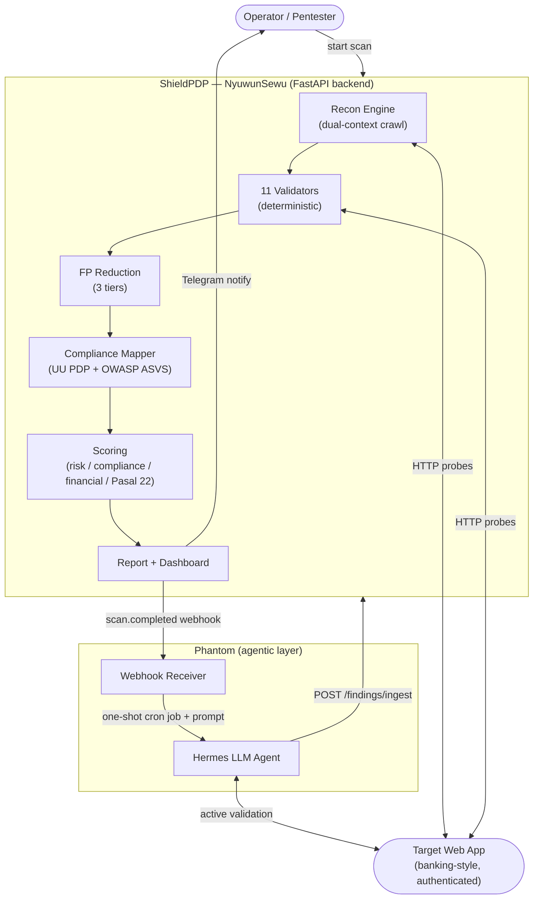
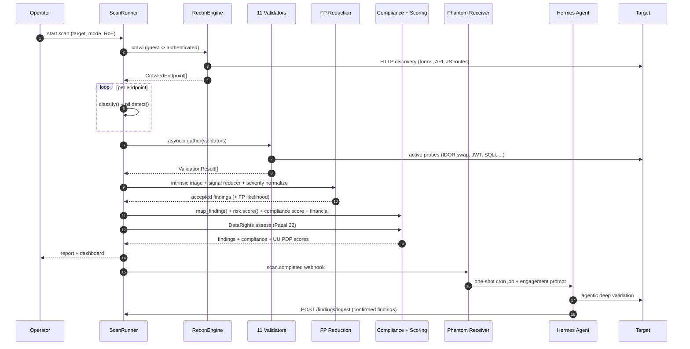
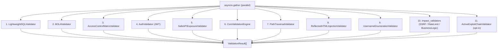
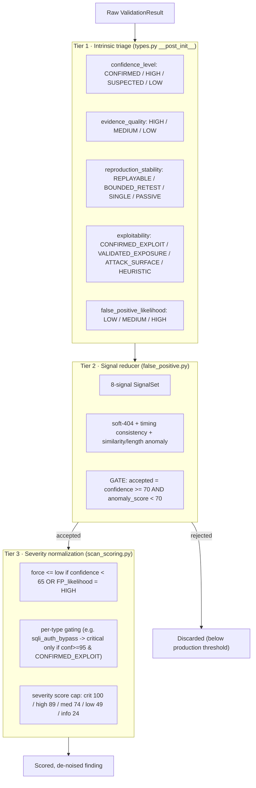
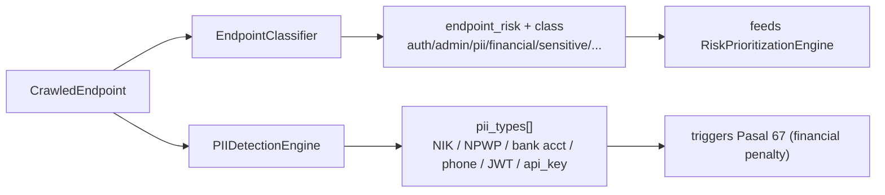
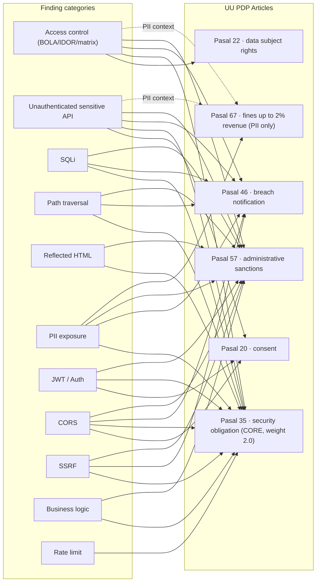
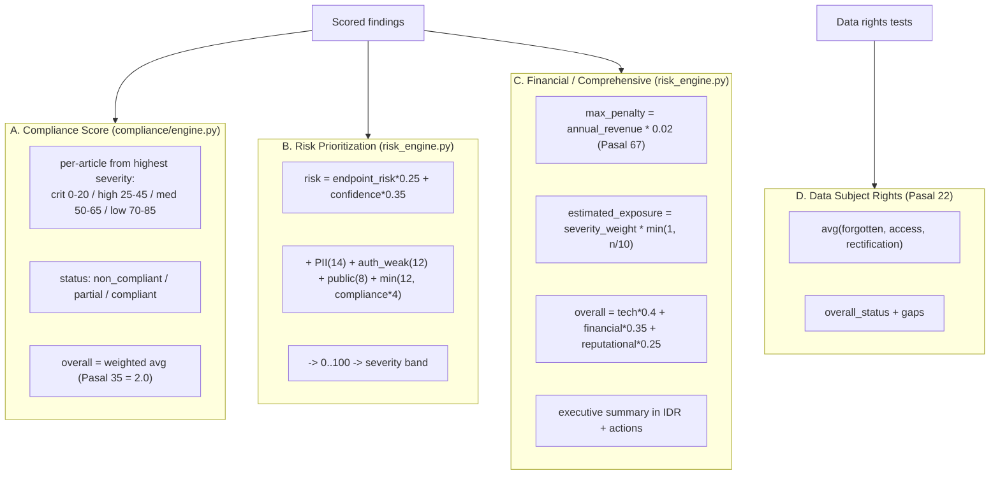
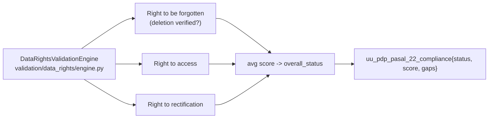
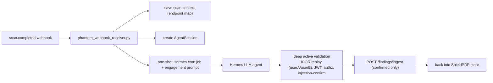

# High-Level Design — NyuwunSewu ShieldPDP Detection & Compliance Pipeline

> **Document type:** High-Level Design (HLD)
> **Scope:** The NyuwunSewu deterministic security-validation engine, its False-Positive (FP) reduction layers, OWASP/UU PDP compliance mapping, and UU PDP scoring — plus the agentic **Phantom** layer that sits on top.
> **Source of truth:** This HLD is reverse-derived from the codebase. Every component cites its `file:path` so the design stays verifiable.
> **Rendering note:** Every diagram below is a self-contained Mermaid block. Each can be rendered directly (GitHub, Mermaid Live), exported to SVG/PNG, or pasted into Gemini / Claude as a design source for image generation.

---

## 1. Positioning (one paragraph)

NyuwunSewu is **not** a surface-level scanner. It is a **deterministic active-validation engine** (11 validators incl. active exploit-chain execution) with a built-in multi-tier **false-positive reducer**, an **OWASP ASVS + UU PDP No. 27/2022 compliance mapper**, and four **UU PDP scoring** subsystems. The **Phantom** agent (LLM-driven, via Hermes) is a *second, agentic layer* that adds recall (catches business-logic false negatives) and a reasoning-based second opinion. The overall thesis is a **hybrid deterministic + agentic** web-application security assessment pipeline that optimizes the precision/recall trade-off of automated DAST.

---

## 2. System Context

---

## 3. Component Architecture

```mermaid
flowchart LR
    subgraph ING["Ingestion"]
        RE["AsyncReconEngine<br/>app/recon/engine.py"]
    end

    subgraph ENR["Per-endpoint enrichment"]
        CL["EndpointClassifier<br/>app/classifier/engine.py"]
        PII["PIIDetectionEngine<br/>app/pii_detection/engine.py"]
    end

    subgraph VAL["Validation layer (11 validators)"]
        V["asyncio.gather fan-out<br/>app/validation/*"]
    end

    subgraph TRI["FP reduction + scoring"]
        T1["Tier 1 intrinsic triage<br/>validation/types.py"]
        T2["Tier 2 signal reducer<br/>validation/false_positive.py"]
        T3["Tier 3 severity normalize<br/>services/scan_scoring.py"]
    end

    subgraph GRC["Governance / compliance"]
        CM["ComplianceMappingEngine<br/>app/compliance/engine.py"]
        RK["RiskPrioritizationEngine<br/>app/services/risk_engine.py"]
        FIN["FinancialRiskEngine<br/>app/services/risk_engine.py"]
        DR["DataRightsValidationEngine<br/>validation/data_rights/*"]
    end

    ORCH["ScanRunner orchestrator<br/>app/services/scan_service.py"]

    RE --> CL --> PII --> V --> T1 --> T2 --> T3 --> RK --> CM
    CM --> FIN
    ORCH -. drives .-> RE
    ORCH -. drives .-> V
    ORCH -. drives .-> DR
    DR -.->|"Pasal 22 track"| GRC
```

**Wiring reference:** `app/services/scan_service.py` `ScanRunner.__init__` instantiates `self.classifier / self.pii / self.compliance / self.risk` (lines 74-77); validators imported and fanned out at lines 39-52 and 512-592; data-rights track at lines 279 and 761.

---

## 4. End-to-End Scan Sequence

---

## 5. Detection Layer — 11 Validators

| # | Validator (class · module) | `finding_type` | Severity | Technique | FP-reducer |
|---|---|---|---|---|---|
| 1 | `LightweightSQLiValidator` · `sqli.py` | `sqli`, `sqli_auth_bypass` | high / **critical** | error / boolean / timing delta + auth-bypass | ✅ |
| 2 | `BOLAValidator` · `bola.py` | `bola_idor` | high / medium | cross-account object access | ✅ |
| 3 | `AccessControlMatrixValidator` · `access_matrix.py` | `access_control_matrix` | high | multi-role matrix (`RoleContext`) | ✅ |
| 4 | `AuthValidator` · `auth.py` | `jwt_observed` (info), `jwt_weakness`, `jwt_claim_integrity_bypass` (**critical**), `missing_authorization` | info → critical | alg:none, unsigned token, claim tamper | ✅ |
| 5 | `SafeAPIExposureValidator` · `api_exposure.py` | `unauthenticated_sensitive_api_exposure`, `client_side_auth_token_storage`, `authentication_cookie_protection`, `graphql_schema_exposure` | high / medium | passive (during crawl) | — |
| 6 | `CorsValidationEngine` · `cors.py` | `cors_credentials_misconfiguration` | high | credentialed cross-origin | — |
| 7 | `PathTraversalValidator` · `path_traversal.py` | `path_traversal` | high | bounded file-like input | — |
| 8 | `ReflectedHTMLInjectionValidator` · `reflected_html.py` | `reflected_html_injection` | medium | inert non-executing DOM canary | — |
| 9 | `UsernameEnumerationValidator` · `username_enumeration.py` | `authentication_username_enumeration` | medium | login differential, no valid password | — |
| 10 | `impact_validators.py` **(3 sub-validators)** | `ssrf_inband_url_fetch` (high), `rate_limit_role_misclassification` (medium), `negative_amount_business_logic` (high) | high / medium | SSRF in-band canary; auth-vs-anon bucket; business invariant | — |
| 11 | `ActiveExploitChainValidator` · `exploit_chains.py` | `jwt_privilege_escalation_execution`, `jwt_forge_endpoint_exposed`, `token_storage_xss_account_takeover_chain`, `oauth_open_redirect_authorization_code_theft`, `authentication_username_enumeration_wordlist`, `modern_vuln_bank_attack_surface` (incl. **AI / prompt-injection probes**) | critical → low | active exploit-chain execution; **opt-in** flag `exploit_chains`; lab targets | — |

> **Counting note:** 11 *modules* are wired. `impact_validators` bundles 3 classes (so 13 validator *classes* total). `attack_knowledge.py` (`AttackKnowledgeEngine`) guides techniques but does not emit findings directly. **Data Subject Rights** (§9) is a separate Pasal-22 compliance validator.

---

## 6. False-Positive Reduction — 3 Tiers

This is the precision differentiator and is fully deterministic / explainable.

**Tier 2 detail** (`app/validation/false_positive.py`): `SignalSet` = `{status_changed, sql_error, boolean_delta, timing_delta, reflected_payload, sensitive_fields, auth_context_changed, authentication_bypass}`. Used by `sqli`, `bola`, `auth`, `access_matrix`. Returns `ReductionDecision(accepted, confidence, anomaly_score, reasoning)` — reasoning is audit-friendly text.

---

## 7. Classification & PII Inputs

- **EndpointClassifier** (`app/classifier/engine.py`): keyword + structure rules → labels (auth, admin, pii, upload, financial, sensitive, internal API, public API); `risk_score` boosted by state-changing method & forms.
- **PIIDetectionEngine** (`app/pii_detection/engine.py`): Indonesia-aware — **NIK** with structural validation (province code + birth-date segment + female day-offset), **NPWP**, `+62` phone, **bank account** (context keywords bca/mandiri/bni/bri/cimb), plus email/JWT/api_key/access_token/UUID. Anti-FP: Luhn test-card filter, dummy-numeric filter, entropy boost.

---

## 8. Compliance Mapping (UU PDP + OWASP ASVS)

`ComplianceMappingEngine.map_finding(finding_type, pii_types)` → list of `ComplianceImpact{framework, article_or_control, privacy_risk, legal_risk, business_risk}`. Source: *UU No. 27 Tahun 2022 tentang Pelindungan Data Pribadi*.

**OWASP ASVS pairing per category:** access-control → V4 · unauth-API → V4 · SQLi → V5 · path-traversal → V5/V8 · reflected-HTML → V5 · PII → V8 · JWT/auth → V2/V3 · CORS → V14/V8 · SSRF → V12/V14 · business-logic → V1/V5 · rate-limit → V2/V7 · fallback → V1.

---

## 9. UU PDP Scoring — 4 Subsystems

**Formulas (verbatim from code):**

- **Per-finding risk** — `risk_engine.py:22`:
  `score = endpoint_risk*0.25 + confidence*0.35 + (PII?14) + (auth_weakness?12) + (public?8) + min(12, compliance_count*4)`, clamped 0–100.
- **Compliance article score** — highest severity maps to a band midpoint; overall = weighted average with `COMPLIANCE_WEIGHTS = {Pasal_35: 2.0, Pasal_20/22/46: 1.5, Pasal_57/67: 1.0}`.
- **Comprehensive overall** — `risk_engine.py:251`: `technical*0.4 + (financial.severity_weight*100)*0.35 + reputational*0.25`.

---

## 10. Data Subject Rights — Pasal 22 Track

Composed via mixins (`RightToBeForgottenMixin`, `RightToAccessMixin`, `RightToRectificationMixin`) on `_DataRightsBase`. Runs as a separate track in `scan_service.py:279`; emits `data_rights_*` finding types.

---

## 11. Phantom Agentic Layer (hybrid recall)

- Two engagement modes: **internal** (owned lab, auth pre-granted) and **external** (live/public, RoE-bound, refusal-first).
- The `feat/phantom-persistent-goal-budget` branch adds **durability** (standing goal + flush-before-spend + checkpoint resume trail) so deep validation survives LLM context compaction — a reliability contribution, not a new attack technique.

---

## Appendix A — Module Map

| Layer | Path |
|---|---|
| Recon | `app/recon/engine.py` |
| Classifier | `app/classifier/engine.py` |
| PII detection | `app/pii_detection/engine.py` |
| Validators (11) | `app/validation/{sqli,bola,access_matrix,auth,api_exposure,cors,path_traversal,reflected_html,username_enumeration,impact_validators,exploit_chains}.py` |
| FP reduction | `app/validation/false_positive.py`, `app/validation/types.py`, `app/services/scan_scoring.py` |
| Compliance | `app/compliance/engine.py` |
| Risk / Financial | `app/services/risk_engine.py` |
| Data rights (Pasal 22) | `app/validation/data_rights/` |
| Orchestrator | `app/services/scan_service.py` |
| Phantom layer | `phantom_webhook_receiver.py` |

## Appendix B — Finding-Type Catalog (by severity ceiling)

- **Critical:** `sqli_auth_bypass`, `jwt_claim_integrity_bypass`, `jwt_privilege_escalation_execution`, `jwt_forge_endpoint_exposed`
- **High:** `sqli`, `bola_idor`, `access_control_matrix`, `missing_authorization`, `unauthenticated_sensitive_api_exposure`, `cors_credentials_misconfiguration`, `path_traversal`, `ssrf_inband_url_fetch`, `negative_amount_business_logic`, `oauth_open_redirect_authorization_code_theft`, `authentication_username_enumeration_wordlist`, `jwt_weakness`
- **Medium:** `reflected_html_injection`, `authentication_username_enumeration`, `rate_limit_role_misclassification`, `client_side_auth_token_storage`, `authentication_cookie_protection`, `graphql_schema_exposure`
- **Info / Low:** `jwt_observed`, `modern_vuln_bank_attack_surface`

---

*Generated as a verifiable HLD: each component is anchored to `file:path` in the ShieldPDP codebase. Diagrams are Mermaid and portable to Gemini / Claude for image generation.*
